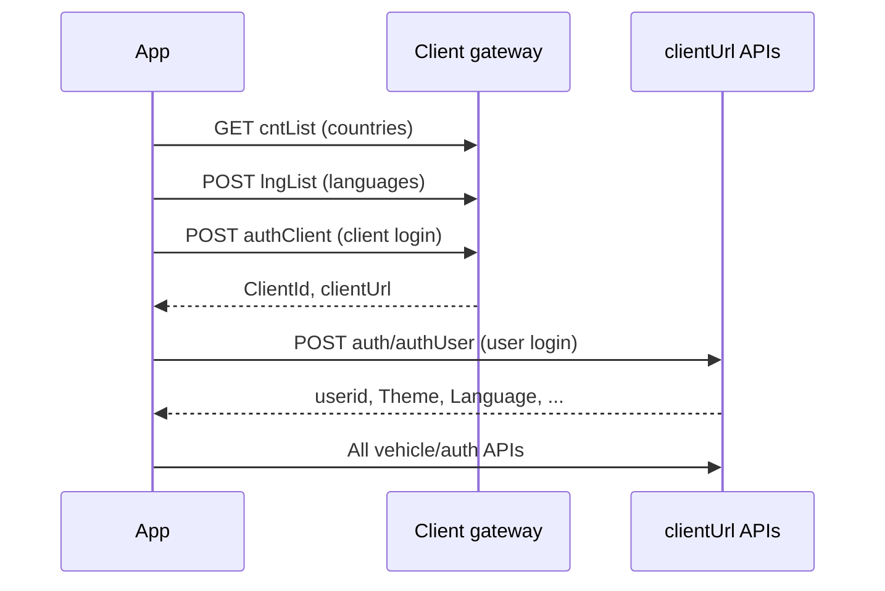

# Infolocate v14

Flutter mobile app for fleet telematics: live vehicle tracking, alerts, video (live/playback), track history, and client branding. This document describes how to integrate with the same backend APIs the app uses.

---

## Table of contents

1. [Overview](#overview)
2. [Quick API URL reference](#quick-api-url-reference)
3. [Environments & base URLs](#environments--base-urls)
4. [Authentication flow](#authentication-flow)
5. [Common API conventions](#common-api-conventions)
6. [Client-level APIs](#client-level-apis)
7. [User / vehicle APIs](#user--vehicle-apis)
8. [External services](#external-services)
9. [Integration sequence](#integration-sequence)
10. [Test credentials](#test-credentials)
11. [Source references](#source-references)

---

## Overview

| Item | Value |
|------|--------|
| App name | `infolocate` |
| HTTP client | [Dio](https://pub.dev/packages/dio) |
| Content-Type | `application/json` |
| Primary config | `lib/utils/app_constants.dart` |
| Request/response models | `lib/screens/**/model/` |
| API services | `lib/screens/**/repository/` |

Two URL tiers:

1. **Client gateway** — fixed staging host for client login, countries, languages, force update.
2. **Tenant `clientUrl`** — returned by client login; all user/vehicle endpoints are `{clientUrl}{path}`.

---

## Quick API URL reference

> **Active config:** `lib/utils/app_constants.dart`  
> **Environment in use:** **Staging** (`clientGatewayBaseUrl`)

### Client gateway base (staging — active)

```
https://iftclientstaging.infotracktelematics.com:7009/fms/mapp/client
```

### Client gateway — full URLs (copy-paste)

| # | Purpose | Method | Full API URL |
|---|---------|--------|--------------|
| 1 | Country list | `GET` | `https://iftclientstaging.infotracktelematics.com:7009/fms/mapp/client/cntList` |
| 2 | Language list | `POST` | `https://iftclientstaging.infotracktelematics.com:7009/fms/mapp/client/lngList` |
| 3 | Client login | `POST` | `https://iftclientstaging.infotracktelematics.com:7009/fms/mapp/client/authClient` |
| 4 | Force update | `POST` | `https://iftclientstaging.infotracktelematics.com:7009/fms/mapp/client/forceUpdateClient` |

**App constants:** `getCountryListUrl`, `getLanguageListUrl`, `authClient`, `forceUpdateUrl`

### Client gateway — production (switch in `app_constants.dart` when ready)

```
https://iftclientprod.infotracktelematics.com:7009/fms/mapp/client
```

| Purpose | Full API URL |
|---------|--------------|
| Country list | `https://iftclientprod.infotracktelematics.com:7009/fms/mapp/client/cntList` |
| Language list | `https://iftclientprod.infotracktelematics.com:7009/fms/mapp/client/lngList` |
| Client login | `https://iftclientprod.infotracktelematics.com:7009/fms/mapp/client/authClient` |
| Force update | `https://iftclientprod.infotracktelematics.com:7009/fms/mapp/client/forceUpdateClient` |

### Tenant APIs — `{clientUrl}` + path

After **client login**, the API returns `clientUrl`. Example staging tenant base:

```
https://iftuserstaging.infotracktelematics.com:7010
```

The app calls: **`{clientUrl}` + `{path}`** (no extra slash between them if `clientUrl` already ends with `/`).

| # | Purpose | Path | Example full URL (staging tenant) |
|---|---------|------|----------------------------------|
| 5 | User login | `auth/authUser` | `https://iftuserstaging.infotracktelematics.com:7010/auth/authUser` |
| 6 | Dashboard | `vehicle/dashCnt` | `https://iftuserstaging.infotracktelematics.com:7010/vehicle/dashCnt` |
| 7 | Alerts list | `vehicle/AlertwiseList` | `https://iftuserstaging.infotracktelematics.com:7010/vehicle/AlertwiseList` |
| 8 | Dynamic status | `vehicle/currDashVehicle` | `https://iftuserstaging.infotracktelematics.com:7010/vehicle/currDashVehicle` |
| 9 | Vehicle status list | `vehicle/vehicleStatusWiseList` | `https://iftuserstaging.infotracktelematics.com:7010/vehicle/vehicleStatusWiseList` |
| 10 | Pin vehicle | `vehicle/pinVehicleList` | `https://iftuserstaging.infotracktelematics.com:7010/vehicle/pinVehicleList` |
| 11 | Video vehicle list | `vehicle/vehiclesList` | `https://iftuserstaging.infotracktelematics.com:7010/vehicle/vehiclesList` |
| 12 | Video playback | `vehicle/vehicleVideoPlayback` | `https://iftuserstaging.infotracktelematics.com:7010/vehicle/vehicleVideoPlayback` |
| 13 | History track | `vehicle/historyTrackVehicle` | `https://iftuserstaging.infotracktelematics.com:7010/vehicle/historyTrackVehicle` |
| 14 | Forgot password | `auth/verifyUser` | `https://iftuserstaging.infotracktelematics.com:7010/auth/verifyUser` |
| 15 | Ads / carousel | `auth/getAdv` | `https://iftuserstaging.infotracktelematics.com:7010/auth/getAdv` |

**App constants:** `authUser`, `dashboardUrl`, `alertwiseList`, `currDashVehicle`, `vehicleStatus`, `pinVehicle`, `videoVehicleList`, `vehicleVideoPlayback`, `historyTrackVehicle`, `forgotPassword`, `adsUrl`

### External URLs (not tenant API)

| Purpose | URL |
|---------|-----|
| Alert video replay page | `https://infosmart.infotracktelematics.com:9965/vss/apiPage/ReplayAlarmServerVideo.html` |
| Google Maps API key | `kGoogleApiKey` in `lib/utils/app_constants.dart` |

### Quick cURL — test APIs directly

**1. Get countries**
```bash
curl -X GET "https://iftclientstaging.infotracktelematics.com:7009/fms/mapp/client/cntList"
```

**2. Get languages (India = 104)**
```bash
curl -X POST "https://iftclientstaging.infotracktelematics.com:7009/fms/mapp/client/lngList" \
  -H "Content-Type: application/json" \
  -d "{\"CountryId\":104}"
```

**3. Client login**
```bash
curl -X POST "https://iftclientstaging.infotracktelematics.com:7009/fms/mapp/client/authClient" \
  -H "Content-Type: application/json" \
  -d "{\"LoginName\":\"arslogistics\",\"LoginPwd\":\"welcome\"}"
```

**4. User login** (replace `CLIENT_URL` from step 3 response)
```bash
curl -X POST "CLIENT_URL/auth/authUser" \
  -H "Content-Type: application/json" \
  -d "{\"LoginName\":\"ars_logistics\",\"LoginPwd\":\"welcome@123\"}"
```

**5. Dashboard** (replace `CLIENT_URL` and `USER_ID`)
```bash
curl -X POST "CLIENT_URL/vehicle/dashCnt" \
  -H "Content-Type: application/json" \
  -d "{\"UserId\":USER_ID,\"cardType\":\"D1\"}"
```

---

## Environments & base URLs

> **All URLs in one place:** see [Quick API URL reference](#quick-api-url-reference) above.

### Staging (used in app today)

| Purpose | Full URL |
|---------|----------|
| Client auth | `https://iftclientstaging.infotracktelematics.com:7009/fms/mapp/client/authClient` |
| Force update | `https://iftclientstaging.infotracktelematics.com:7009/fms/mapp/client/forceUpdateClient` |
| Country list | `https://iftclientstaging.infotracktelematics.com:7009/fms/mapp/client/cntList` |
| Language list | `https://iftclientstaging.infotracktelematics.com:7009/fms/mapp/client/lngList` |

### Production (commented in code; switch when ready)

**Base URL:**
```
https://iftclientprod.infotracktelematics.com:7009/fms/mapp/client
```

| Purpose | Full URL |
|---------|----------|
| Client auth | `https://iftclientprod.infotracktelematics.com:7009/fms/mapp/client/authClient` |
| Force update | `https://iftclientprod.infotracktelematics.com:7009/fms/mapp/client/forceUpdateClient` |
| Country list | `https://iftclientprod.infotracktelematics.com:7009/fms/mapp/client/cntList` |
| Language list | `https://iftclientprod.infotracktelematics.com:7009/fms/mapp/client/lngList` |

**Alternate staging host (legacy):** `https://mclientstaging.infotracktelematics.com:7009/fms/mapp/client/authClient`

### Tenant base (`clientUrl`)

After successful client login, use the `clientUrl` from the response. Example from production notes:

`https://iftuserstaging.infotracktelematics.com:7010`

**Important:** `clientUrl` must include a trailing path segment if the server returns one (e.g. ends with `/`). The app concatenates paths directly: `clientUrl + "vehicle/dashCnt"`.

### Relative paths (append to `clientUrl`)

| Constant | Path |
|----------|------|
| `authUser` | `auth/authUser` |
| `dashboardUrl` | `vehicle/dashCnt` |
| `alertwiseList` | `vehicle/AlertwiseList` |
| `currDashVehicle` | `vehicle/currDashVehicle` |
| `vehicleStatus` | `vehicle/vehicleStatusWiseList` |
| `pinVehicle` | `vehicle/pinVehicleList` |
| `videoVehicleList` | `vehicle/vehiclesList` |
| `vehicleVideoPlayback` | `vehicle/vehicleVideoPlayback` |
| `historyTrackVehicle` | `vehicle/historyTrackVehicle` |
| `forgotPassword` | `auth/verifyUser` |
| `adsUrl` | `auth/getAdv` |

---

## Authentication flow



1. **Client login** → obtain `ClientId` and `clientUrl`.
2. **User login** → `POST {clientUrl}auth/authUser` with credentials.
3. Store `userid` for all subsequent vehicle APIs (`UserId` in body).

There is no Bearer token in headers in this codebase; session is implicit per client/user login on the server.

---

## Common API conventions

### HTTP methods

| Tier | Method |
|------|--------|
| Country list | `GET` |
| All others documented here | `POST` |

### Success

- HTTP status `200`.
- Body usually wraps payload in `"data": { ... }` (some endpoints also accept the inner object at the root — dashboard handles both).

### Errors

Failed auth/business errors often return HTTP 4xx with:

```json
{
  "data": {
    "status": 400,
    "error": [
      { "message": "Authentication failed" }
    ]
  }
}
```

Read `error[0].message` for user-facing text.

### Pagination

| Field | Type | Description |
|-------|------|-------------|
| `pSize` | int | Page size (app default: `10`, max used: `100`) |
| `PNo` | int | Page number (1-based; default `1`) |

### Date/time formats

| Use case | Format | Example |
|----------|--------|---------|
| Alerts filter | `yyyy-MM-dd hh:mm:ss` | `2023-04-27 00:00:00` |
| History track | `yyyy-MM-dd HH:mm:ss` | `2023-05-11 00:00:00` |
| Video playback request | `yyyy-MM-dd HH:mm:ss` | `2023-05-04 02:35:00` |
| Video playback response | `yyyyMMddHHmmss` | `20230504023500` |

Request keys for alerts: `fromdt`, `todt` (not `alertdt`).

### SSL

The app accepts self-signed certificates via `AppHelper.onHttpClientCreate` (`badCertificateCallback`). For production integrations, use proper certificates or mirror this only in dev.

### Card types (dashboard UI)

| `cardType` | Meaning |
|------------|---------|
| `D1` | Vehicle status summary |
| `D2` | Alert type count |
| `D3` | Pinned vehicle detail |

---

## Client-level APIs

### 1. Get countries

| | |
|--|--|
| **Method** | `GET` |
| **URL** | `https://iftclientstaging.infotracktelematics.com:7009/fms/mapp/client/cntList` |
| **Auth** | None |

**Response** (`data` wrapper):

```json
{
  "data": {
    "status": 200,
    "countryList": [
      {
        "id": 104,
        "CountryName": "India",
        "isActive": true
      }
    ]
  }
}
```

---

### 2. Get languages by country

| | |
|--|--|
| **Method** | `POST` |
| **URL** | `https://iftclientstaging.infotracktelematics.com:7009/fms/mapp/client/lngList` |
| **Body** | `{ "CountryId": 104 }` |

**Response:**

```json
{
  "data": {
    "status": 200,
    "langListData": [
      {
        "languageId": 252,
        "Country_Id": 104,
        "Language": "English",
        "Langconvert": "en",
        "isActive": true
      }
    ]
  }
}
```

Use `Langconvert` (e.g. `en`, `ja`, `es`) for app locale.

---

### 3. Client login (`authClient`)

| | |
|--|--|
| **Method** | `POST` |
| **URL** | `https://iftclientstaging.infotracktelematics.com:7009/fms/mapp/client/authClient` |
| **Body** | See below |

**Request:**

```json
{
  "LoginName": "arslogistics",
  "LoginPwd": "welcome"
}
```

**Success response:**

```json
{
  "data": {
    "status": 200,
    "client": {
      "ClientId": 1,
      "clientUrl": "https://iftuserstaging.infotracktelematics.com:7010/",
      "currentVersion": 0
    }
  }
}
```

**Error response:**

```json
{
  "data": {
    "status": 400,
    "error": [{ "message": "Authentication failed" }]
  }
}
```

Persist `ClientId` and `clientUrl` for all later calls.

---

### 4. Force update check

| | |
|--|--|
| **Method** | `POST` |
| **URL** | `https://iftclientstaging.infotracktelematics.com:7009/fms/mapp/client/forceUpdateClient` |

**Request:**

```json
{
  "ClientId": 1,
  "Appversion": 0,
  "AppId": 1
}
```

| Field | Notes |
|-------|--------|
| `AppId` | `1` in app (platform identifier) |
| `Appversion` | Build/version code sent as integer |

**Success response** (may be top-level or under `data` depending on server; app parses top-level `ForceUpdateModelData`):

```json
{
  "status": 200,
  "client": {
    "Forceupdate": 0,
    "CurrentVersion": 0
  }
}
```

| `Forceupdate` | Meaning |
|---------------|---------|
| `0` | No forced update |
| `1` | Mandatory update dialog |

---

## User / vehicle APIs

Base: **`{clientUrl}`** from client login.

### 5. User login (`authUser`)

| | |
|--|--|
| **Method** | `POST` |
| **URL** | `{clientUrl}auth/authUser` |

**Request:**

```json
{
  "LoginName": "ars_logistics",
  "LoginPwd": "welcome@123"
}
```

**Success response:**

```json
{
  "data": {
    "status": 200,
    "user": {
      "userid": 3,
      "Username": "Infotrack",
      "Theme": 1,
      "Language": "en",
      "ClientId": 1,
      "IsAdvertise": false
    }
  }
}
```

| Field | Usage |
|-------|--------|
| `userid` | Send as `UserId` in vehicle APIs |
| `Theme` | UI theme id |
| `Language` | Locale code |
| `IsAdvertise` | Whether to load carousel ads |

---

### 6. Forgot password (`verifyUser`)

| | |
|--|--|
| **Method** | `POST` |
| **URL** | `{clientUrl}auth/verifyUser` |
| **Requires** | Client login completed (`clientUrl` available) |

**Request:**

```json
{
  "LoginName": "ars_logistics"
}
```

**Success response:**

```json
{
  "data": {
    "status": 200,
    "data": {
      "ResultID": 1,
      "ResultMessage": "User exsits",
      "Userid": 1,
      "Username": "Infotrack",
      "Authword": "infoadmin",
      "EmailId": "user@example.com"
    },
    "message": "Email sent successfully"
  }
}
```

---

### 7. Get advertisements

| | |
|--|--|
| **Method** | `POST` |
| **URL** | `{clientUrl}auth/getAdv` |

**Request** (JSON string body in app):

```json
{
  "clientId": 1
}
```

**Success response:**

```json
{
  "data": {
    "status": 200,
    "advertise": [
      {
        "ClientAdvertiseID": 13,
        "ClientID": 1,
        "ClientAdvertiseUrl": "https://example.com/images/banner.png",
        "CreateDate": "2023-06-08T18:02:00.000Z",
        "ValidDate": "2023-06-17T15:00:00.000Z"
      }
    ]
  }
}
```

---

### 8. Dashboard counts (`dashCnt`)

| | |
|--|--|
| **Method** | `POST` |
| **URL** | `{clientUrl}vehicle/dashCnt` |

**Request:**

```json
{
  "UserId": 3,
  "pSize": 10,
  "PNo": 1
}
```

**Success response** (inner payload; may be under `data` or at root):

```json
{
  "status": 200,
  "VehicleStatus": [
    {
      "cardType": "D1",
      "status": "Inactive",
      "Value": 8,
      "StatusID": 4,
      "Cid": 1,
      "SequenceId": 1
    }
  ],
  "StatusCount": [
    {
      "cardType": "D2",
      "id": 1,
      "AlertCount": 18,
      "AlertTypeID": 9,
      "cid": 2,
      "AlertType": "Over Speed"
    }
  ],
  "Pinvehicle": [
    {
      "cardType": "D3",
      "id": 1,
      "VehicleId": 34,
      "VehicleNo": "72070",
      "DriverName": null,
      "TrackingTime": "2023-04-24 19:42:04",
      "Location": "Address string",
      "speed": 0,
      "ignition": "On",
      "odometer": 1367.33,
      "Idleduration": 28675,
      "Status": "Idle",
      "DelayEnable": 90,
      "LiveUrl": "https://.../RealVideo.html?...",
      "Mapit": "33.2293,131.603",
      "Cid": 3
    }
  ]
}
```

`Mapit` = `"latitude,longitude"`.

---

### 9. Dynamic status / current dashboard vehicles (`currDashVehicle`)

| | |
|--|--|
| **Method** | `POST` |
| **URL** | `{clientUrl}vehicle/currDashVehicle` |

**Request:**

```json
{
  "UserId": 3,
  "pSize": 100,
  "PNo": 1,
  "sSearch": ""
}
```

**Success response:**

```json
{
  "data": {
    "status": 200,
    "vehicledetails": [
      {
        "id": 1,
        "VehicleId": 188,
        "VehicleNo": "Truck 2",
        "TrackingTime": "Jul 31 2023  6:02AM",
        "Location": "4479-4301 Mason St, South Gate, CA 90280",
        "speed": 0,
        "ignition": "On",
        "odometer": 19534.49,
        "Status": "Idle",
        "DelayEnable": 90,
        "LiveUrl": "https://.../RealVideo.html?...",
        "Mapit": "33.9536,-118.192",
        "Idleduration": 0,
        "devicetype": "MDVR"
      }
    ],
    "vehicleCnt": [{ "reccount": 10 }]
  }
}
```

---

### 10. Vehicle status-wise list

| | |
|--|--|
| **Method** | `POST` |
| **URL** | `{clientUrl}vehicle/vehicleStatusWiseList` |

**Request:**

```json
{
  "UserId": 3,
  "StatusId": 4,
  "pSize": 10,
  "PNo": 1,
  "sSearch": ""
}
```

| `StatusId` | Typical status (from app constants) |
|------------|-------------------------------------|
| From dashboard `StatusID` | e.g. idle, moving, stopped, inactive |

**Success response:**

```json
{
  "data": {
    "status": 200,
    "vehicleStatusdetails": [
      {
        "id": 1,
        "Vehicleid": 38,
        "Clientid": 20,
        "VehicleNo": "91004",
        "unitno": "91004",
        "tracktime": "2022-12-27T18:22:00.000Z",
        "Lat": 12.991,
        "lon": 77.588,
        "location": "Address",
        "ignition": 0,
        "speed": 0,
        "odometer": 1575.94,
        "direction": 357,
        "idleduration": 91,
        "stopduration": 0,
        "alertind": 0,
        "EngineOffdelay": 0,
        "Directions": 0,
        "Status": "Inactive",
        "LiveUrl": "https://.../RealVideo.html?...",
        "vstatus": "All Vehicles",
        "IsPinVehicle": 0,
        "devicetype": "MDVR"
      }
    ],
    "vehicleCount": [{ "recCnt": 44 }]
  }
}
```

---

### 11. Pin / unpin vehicle

| | |
|--|--|
| **Method** | `POST` |
| **URL** | `{clientUrl}vehicle/pinVehicleList` |

**Request:**

```json
{
  "ClientId": 1,
  "UserId": 3,
  "Vehicleid": 34,
  "InsertMode": 0
}
```

| `InsertMode` | Action |
|--------------|--------|
| `0` | Pin vehicle |
| `1` | Unpin vehicle |

**Success response:**

```json
{
  "data": {
    "status": 200,
    "pinvehicle": [
      {
        "Resultid": "1",
        "Remark": "Vehicle added Sucessfully"
      }
    ]
  }
}
```

---

### 12. Alert list (`AlertwiseList`)

| | |
|--|--|
| **Method** | `POST` |
| **URL** | `{clientUrl}vehicle/AlertwiseList` |

**Request:**

```json
{
  "UserId": 3,
  "AlertTypeId": 10,
  "pSize": 100,
  "PNo": 1,
  "fromdt": "2023-04-27 00:00:00",
  "todt": "2023-04-27 23:59:59",
  "vno": ""
}
```

| Field | Notes |
|-------|--------|
| `AlertTypeId` | Filter by type; use id from dashboard `AlertTypeID` |
| `vno` | Vehicle number filter; empty string = all |

**Success response:**

```json
{
  "data": {
    "status": 200,
    "alertdetails": [
      {
        "Id": 11,
        "AlertTypeID": 28,
        "AlertType": "yaccel end",
        "VehicleID": 190,
        "DriverID": null,
        "Alertdatetime": "2023-05-15 14:42:17",
        "Lat": 33.699,
        "Lon": 135.41,
        "Location": "Address",
        "ignition": 0,
        "speed": 0,
        "direction": 0,
        "VehicleNo": "o6e2oohgkg",
        "Videofilepath": "1|base64path,2|base64path",
        "VFC": 4,
        "Status": "Alert",
        "Unitid": 6,
        "UnitNo": "62055",
        "drivername": "",
        "devicetype": "MDVR"
      }
    ],
    "alertcnt": [{ "TotRec": 21 }],
    "alerttypes": [
      { "AlertTypeID": 9, "AlertType": "Over Speed" }
    ]
  }
}
```

**Alert video path:** `Videofilepath` is comma-separated `channel|encodedPath` pairs. Decode for playback — see [Alert video playback](#alert-video-playback).

---

### 13. Track history

| | |
|--|--|
| **Method** | `POST` |
| **URL** | `{clientUrl}vehicle/historyTrackVehicle` |

**Request:**

```json
{
  "UserId": 3,
  "VehicleID": 34,
  "FromDatetime": "2023-05-11 00:00:00",
  "ToDatetime": "2023-05-11 23:00:00"
}
```

**Success response:**

```json
{
  "data": {
    "status": 200,
    "VehicleHistory": [
      {
        "VehicleId": 34,
        "ClientID": 1,
        "VehicleNo": "72070",
        "Unitno": "72070",
        "tracktime": "05/10/2023 03:00:04",
        "lat": 33.229,
        "lon": 131.602,
        "location": "Address",
        "speed": 0,
        "odometer": 1367.33,
        "direction": 321,
        "idleduration": 75080,
        "stopduration": 0,
        "AlertInd": 0,
        "Directions": 315,
        "VehicleType": "4 Wheeler"
      }
    ]
  }
}
```

---

### 14. Video — vehicle list

| | |
|--|--|
| **Method** | `POST` |
| **URL** | `{clientUrl}vehicle/vehiclesList` |

**Request:**

```json
{
  "UserId": 3
}
```

**Success response:**

```json
{
  "data": {
    "status": 200,
    "vehicles": [
      {
        "VehicleId": 50,
        "VehicleNo": "27",
        "DelayEnable": 90,
        "devicetype": "MDVR"
      }
    ]
  }
}
```

---

### 15. Video — playback URL

| | |
|--|--|
| **Method** | `POST` |
| **URL** | `{clientUrl}vehicle/vehicleVideoPlayback` |

**Request:**

```json
{
  "UserId": 3,
  "VehicleID": 14,
  "StartDate": "2023-05-04 02:35:00",
  "EndDate": "2023-05-04 02:40:00"
}
```

**Success response:**

```json
{
  "data": {
    "status": 200,
    "playbackvideo": [
      {
        "vehicleid": 14,
        "Purl": "https://.../ReplayVideo.html?token=...&deviceId=62071&chs=1_2_3_4&st=20230504023500&et=20230504024000",
        "startdate": "20230504023500",
        "enddate": "20230504024000"
      }
    ]
  }
}
```

Open `Purl` in a WebView or browser for recorded video.

**Live video:** use `LiveUrl` from vehicle/dashboard responses (`RealVideo.html`).

---

## External services

### Google Maps

- API key: `kGoogleApiKey` in `lib/utils/app_constants.dart`
- Used for maps, geocoding, and `Mapit` coordinates (`lat,lon` string)

### Alert video playback

Base page (constants in `app_constants.dart`):

`https://infosmart.infotracktelematics.com:9965/vss/apiPage/ReplayAlarmServerVideo.html`

Built URL per channel:

```
{baseUrl}?token={kToken}&deviceId={UnitNo}&chs={channel}&fpath={encodedPath}
```

- `Videofilepath` format: `1|path1,2|path2,...`
- Token: `kToken` in `app_constants.dart`

### Vehicle status constants (app filters)

| Key | Value |
|-----|--------|
| idle | `idle` |
| moving | `moving` |
| stopped | `stopped` |
| inactive | `inactive` |

---

## Integration sequence

1. `GET` countries → user picks country  
2. `POST` languages with `CountryId` → user picks language  
3. `POST` authClient → save `clientUrl`, `ClientId`  
4. `POST` `{clientUrl}auth/authUser` → save `userid`  
5. Optional: `POST` forceUpdateClient on app launch if client already saved  
6. `POST` `{clientUrl}vehicle/dashCnt` for home screen  
7. Feature APIs as needed (alerts, history, video, pin, etc.)

**Minimal cURL — client login:**

```bash
curl -X POST "https://iftclientstaging.infotracktelematics.com:7009/fms/mapp/client/authClient" \
  -H "Content-Type: application/json" \
  -d "{\"LoginName\":\"arslogistics\",\"LoginPwd\":\"welcome\"}"
```

**Minimal cURL — user login** (replace `CLIENT_URL`):

```bash
curl -X POST "CLIENT_URL/auth/authUser" \
  -H "Content-Type: application/json" \
  -d "{\"LoginName\":\"ars_logistics\",\"LoginPwd\":\"welcome@123\"}"
```

---

## Test credentials

### Staging

| Step | Username | Password |
|------|----------|----------|
| Client login | `arslogistics` | `welcome` |
| User login | `ars_logistics` | `welcome@123` |

### Production (from legacy notes)

| Step | Username | Password |
|------|----------|----------|
| Client login | `Arstravels` | `welcome` |

Production client redirect example: `https://iftuserstaging.infotracktelematics.com:7010`

---

## Source references

| Area | Path |
|------|------|
| URL constants | `lib/utils/app_constants.dart` |
| Client login | `lib/screens/login/repository/client_repo.dart` |
| User login | `lib/screens/login/repository/user_repo.dart` |
| Dashboard | `lib/screens/dashboard/repository/dashboard_repo.dart` |
| Alerts | `lib/screens/alerts/respositroy/alert_repo.dart` |
| Dynamic status | `lib/screens/dynamic_status/respository/dyanmic_status_repo.dart` |
| Vehicle list / history | `lib/screens/vehicle_statuswise_list/repository/vehicle_status_repo.dart` |
| Pin vehicle | `lib/screens/pin_vehicles/repository/pin_vehicle_repo.dart` |
| Video | `lib/screens/video_playback/repository/video_playback_repo.dart` |
| Countries / languages | `lib/screens/language/repository/language_service.dart` |
| Force update | `lib/screens/splash/repository/splash_repo.dart` |
| Ads | `lib/screens/dashboard/repository/ads_repo.dart` |
| Forgot password | `lib/screens/forgot_password/repository/forgot_password_repo.dart` |

---

## Running the Flutter app

```bash
flutter pub get
flutter run
```

Requires Flutter SDK `>=3.3.3` (see `pubspec.yaml`). Use [FVM](https://fvm.app/) if `.fvmrc` is present in the project.
